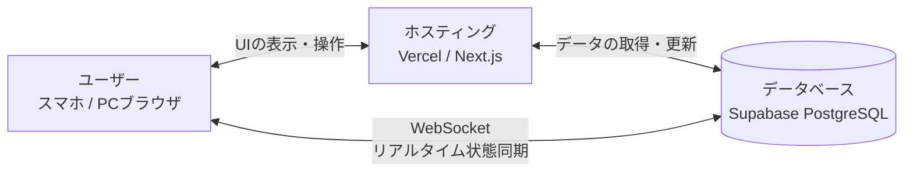

# Hallucination (ハルシネーション) - 人狼ゲーム

- **概要**
  本作は、サイバー空間を舞台にしたブラウザベースの「人狼」アプリケーションである。友人同士で通話しながら、または対面で集まってスマートフォンやPCから手軽に遊ぶことを想定している。
  最大の特徴は、デジタルゲームならではのギミック**「ハルシネーションシステム」**を搭載している点である。プレイヤーのうちランダムな1名はシステムから嘘の役職と嘘の行動結果を提示され、自身の本当の役職に気付かないまま議論に参加することになる。

- **開発の背景・経緯**
  従来のアナログなワンナイト人狼や、それを単に模倣したデジタルアプリでは「プレイヤーが嘘をつく」ことはあっても、「ゲームのシステム（UI）自体がプレイヤーに嘘をつく」ことは不可能であった。
  そこで、「画面に表示されている自分の役職すらも信じられない」という、デジタル空間ならではの新しい疑心暗鬼を生み出したいと考え、本アプリの開発に至った。システムをハッキングする「マルウェア」や、隔離（パージ）されることを望む「トロイ」など、IT用語をモチーフにした独自の世界観と役職を構築している。

- **公開URL**
  https://hallucination-nine.vercel.app/

## 特徴と機能の説明

本アプリは、サイバー空間へのハッキングをモチーフにしたUIを採用しており、ゲームの進行に合わせて以下の機能を提供する。

**1. システム接続と役職編成（待機ロビー）**
  [ここにログイン画面、またはホストの役職設定画面のスクリーンショットを挿入]
  プレイヤーはモデル名を入力してシステムに接続する。ホストは参加人数に合わせて「Malware（人狼）」「Stable（村人）」「Trojan（てるてる）」などの独自役職の枚数を自在に設定し、ゲームを開始することができる。

**2. 夜の行動フェーズ（ハルシネーションの発動）**
  [ここに夜フェーズでの役職提示・ターゲット選択画面のスクリーンショットを挿入]
  夜フェーズでは各自に役職が割り当てられるが、毎ゲームランダムに1名が「ハルシネーション（幻覚）」状態となる。幻覚状態のプレイヤーには真の役職とは全く異なる役職が表示され、対象をスキャン（占い）した場合も、システムからもっともらしい「嘘の結果」が返却される。

**3. 昼の議論フェーズとリアルタイム同期タイマー**
  [ここに昼フェーズの大きくタイマーが表示されている画面のスクリーンショットを挿入]
  Supabase Realtimeを活用し、全員の画面で3分間のカウントダウンタイマーが寸分の狂いなく同期される。議論の状況に応じて、過半数の合意による「時短（スキップ）」や「延長（+2分）」のリアルタイム投票機能も完備しており、快適な議論をサポートする。

**4. 投票フェーズと「平和村」システム**
  [ここに投票画面・SYSTEM ALL CLEARボタンのスクリーンショットを挿入]
  議論終了後、パージ（追放）する対象を1つ選択する。通常のプレイヤーへの投票に加え、「SYSTEM ALL CLEAR（異常なし）」への投票機能を搭載。過半数がこれに投票し、実際にマルウェアが不在であれば全員勝利となる「平和村」ロジックを実装している。

**5. 最終リザルト画面（真実の種明かし）**
  [ここに最終結果と[HALLUCINATION]の文字が見えるリザルト画面のスクリーンショットを挿入]
  勝敗が決すると、全プレイヤーの「最終的な真の役職」と「投票先」が一覧で表示される。ここで初めて、誰がハルシネーションに陥り、何の役職だと誤認（自認）していたのかが明かされる。自分の画面すら信じられない状態からの種明かしは、感想戦を最高に盛り上げる。
## 使用技術 (技術スタック)

- **フロントエンド (言語・フレームワーク)**
  - TypeScript
  - Next.js (App Router)
  - React
  - Tailwind CSS

- **バックエンド・データベース**
  - Next.js Server Actions (秘匿情報の計算・処理)
  - Supabase (PostgreSQL / Realtime)

- **開発ツール・インフラ**
  - Vercel (ホスティング・自動デプロイ)
  - Zed
  - Git / GitHub

- **システム構成図**

## 開発期間・体制

- **開発体制**: 個人開発
- **開発期間**: 2026.02.10 ~ 2026.02.22 (約 10 時間)

## 工夫した点・苦労した点

- **従来の人狼ゲームへの差別化**
  アナログな人狼ゲームや既存のアプリでは「プレイヤー自身が嘘をつく」ことしかできないが、本作では「システム（UI）自体が特定のプレイヤーに嘘をつく」というデジタル環境ならではのギミックを核として開発した。また、単にルールを変えるだけでなく「システムハッキング」をテーマにしたサイバー空間という世界観を設定し、それに合わせて役職名（Malware、Stable、Trojanなど）やUIを統一することで、既存の人狼ゲームにはない圧倒的な没入感とオリジナリティを生み出している。また、自作のメリットとして、広告などを設置する必要がなく、快適にゲームができる。
- **「嘘のデータ」を矛盾なく生成するロジック**
  ハルシネーション対象者が「占い師（Scanner）」や「怪盗（Scraper）」の幻覚を見ている場合、システムはそれに合わせて「ランダムな嘘の役職データ」を即座に生成して返す必要がある。プレイヤーに「自分がバグっている」と気づかせないよう、自然なレスポンスを組み立てる条件分岐の設計に工夫を凝らした。

## 既知の課題と今後の展望

- **UI/UXのさらなるサイバーパンク化**
  現状は静的な画面遷移が主であるため、ハルシネーション状態が発覚した際のリザルト画面に「グリッチ（画面の乱れ）エフェクト」を導入し、より劇的な種明かしを演出したい。また、システム音やBGMの追加も検討中である。

- **セキュリティの完全化 (Supabase RLSの導入)**
  現在はサーバーサイドへのロジック移行によりソースコード上の機密性は確保されているが、熟練のユーザーによるデータベースへの直接アクセスを防ぐため、次期アップデートにてSupabaseのRow Level Security (RLS) を導入した完全なアクセス制御を実装予定である。

- **UI改善**
  議論時間の際、役職の名乗りや、役職の効果実行結果をログやボタンで表示させることで、快適な議論を可能になるよう、調整中である。
